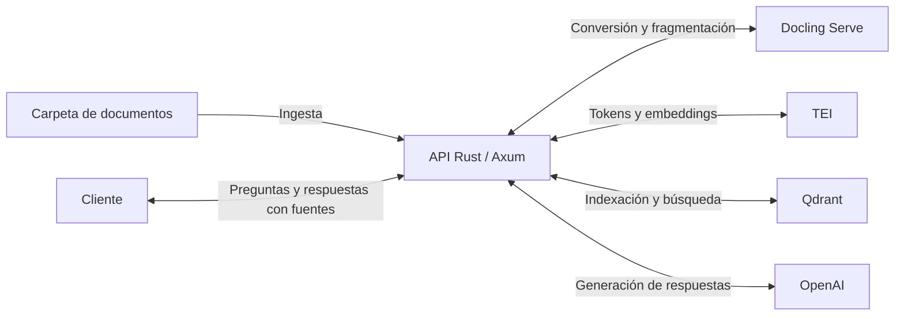

# Tisenda API

El proyecto está orientado a resolver rápidamente las preguntas que los distintos departamentos dirigen al área de IT, utilizando la documentación interna como fuente. Por ejemplo, permite consultar qué consumible necesita una impresora y cómo sustituirlo, para facilitar la atención de dudas frecuentes.

API HTTP y biblioteca Rust para consultar documentos mediante generación aumentada por recuperación (RAG). Procesa archivos de una carpeta local, crea un índice vectorial y responde preguntas con referencias a los originales.

Admite PDF, documentos de Office OOXML, HTML, Markdown, texto, CSV, AsciiDoc, imágenes y subtítulos VTT. El catálogo de extensiones está definido en [src/docling/formats.rs](src/docling/formats.rs).

## Cómo funciona

- **Docling Serve** convierte los documentos y genera fragmentos de texto, con OCR configurable.
- **Text Embeddings Inference (TEI)** valida los tokens y genera embeddings.
- **Qdrant** almacena los fragmentos, sus vectores y su procedencia.
- **SQLite** conserva las identidades documentales, la cola de ingesta y su historial.
- **OpenAI** genera respuestas a partir de los fragmentos recuperados.



La API y su worker integrado se ejecutan en el host. [compose.yaml](compose.yaml) levanta Docling Serve, TEI y Qdrant; Qdrant y la caché del modelo TEI usan volúmenes persistentes de Podman. SQLite guarda el catálogo documental, la cola y el historial en `INGESTIONS_DB_PATH`, cuyo valor predeterminado es `data/ingestions.sqlite`.

## Puesta en marcha

Ejecuta los comandos desde la raíz del repositorio.

### 1. Preparar la configuración y los documentos

Si aún no tienes una configuración local, copia la plantilla:

```bash
cp .env.example .env
```

Edita `.env` para establecer `OPENAI_API_KEY` y revisar `DOCUMENTS_ROOT`. La plantilla utiliza `corpus`; crea esa carpeta y coloca allí los documentos que quieras indexar:

```bash
mkdir -p corpus
```

Si eliges otra ruta, asegúrate de que exista y sea legible. Las rutas relativas se resuelven desde el directorio de ejecución.

[.env.example](.env.example) documenta las variables de conexión, modelos, OCR y límites de procesamiento. El modelo, la revisión y la dimensión de embeddings deben ser compatibles con TEI y con el índice. La API carga `.env` al iniciar y da prioridad a las variables ya definidas en el proceso; los cambios requieren reiniciar el componente correspondiente.

### 2. Levantar los servicios

```bash
podman compose up -d
podman compose logs -f docling tei
```

Espera a que los servicios terminen de cargar sus modelos. Puedes comprobar la disponibilidad de Docling con:

```bash
curl --fail-with-body http://127.0.0.1:5001/ready
```

### 3. Iniciar la API

```bash
cargo run --locked
```

La API crea la base SQLite y sus directorios al iniciar. Una segunda instancia que use la misma base no podrá adquirir su bloqueo exclusivo.

Abre [Scalar](http://127.0.0.1:3000/docs), ejecuta una ingesta de los documentos y después realiza una consulta. Es necesario indexar documentos antes de poder consultar sus contenidos.

## Documentación de la API

Scalar reúne los endpoints, los esquemas de entrada y salida, los ejemplos y los estados HTTP. Desde allí también puedes ejecutar solicitudes. La especificación OpenAPI se genera desde los handlers y tipos Rust con `utoipa`.

Estas direcciones corresponden a la configuración local de la plantilla:

| Recurso | Dirección |
|---|---|
| Referencia interactiva de la API | [Scalar](http://127.0.0.1:3000/docs) |
| Especificación para herramientas y clientes | [OpenAPI](http://127.0.0.1:3000/openapi.json) |
| Interfaz de conversión | [Docling](http://127.0.0.1:5001/ui) |
| Explorador del índice vectorial | [Qdrant](http://127.0.0.1:6333/dashboard) |

Scalar necesita acceso desde el navegador a `cdn.jsdelivr.net` para cargar su JavaScript.

## Ingesta asíncrona

```bash
curl --fail-with-body -i http://127.0.0.1:3000/ingestions \
  -H 'Content-Type: application/json' \
  -d '{"paths":["manual.pdf","catalogos"]}'
```

En una sola transacción SQLite se registra o recupera la identidad de cada documento y se crean el lote y sus trabajos. Después de confirmar esa transacción, devuelve `202 Accepted`, una cabecera `Location: /ingestions/{batch_id}` y este cuerpo:

```json
{"batch_id":"<uuid>","total":12,"status_url":"/ingestions/<uuid>"}
```

`{}` o `{"paths":[]}` selecciona toda la raíz. La lista se resuelve, ordena y deduplica al aceptar el lote. Los archivos añadidos después requieren otra solicitud. El contenido de cada archivo se lee cuando llega su turno, también en los reintentos.

```bash
curl --fail-with-body 'http://127.0.0.1:3000/ingestions/<uuid>?limit=100&offset=0'
```

La consulta devuelve `batch_id`, `status`, `counts`, `created_at`, `finished_at`, `limit`, `offset` y `documents`. El límite predeterminado es 100 y el máximo 500; un lote inexistente devuelve 404. Los contadores abarcan todo el lote, independientemente de la página. `status=completed` indica que todos los trabajos terminaron, incluidos los rechazados o fallidos; una selección vacía termina inmediatamente.

Cada documento incluye `job_id`, `document_id`, `source_key`, `filename`, `status`, `stage`, `result`, `attempts`, fechas, `original_sha256`, `task_ids`, `chunks`, `profile`, `warnings` y `error`. Las fechas son milisegundos UTC desde Unix epoch; `next_attempt_at` indica cuándo vuelve a estar disponible un pendiente. Distintos trabajos para el mismo documento conservan su `document_id`.

| Estado del documento | Significado |
|---|---|
| `pending` | En cola o esperando un reintento |
| `processing` | En ejecución |
| `completed` | Éxito |
| `completed_with_warnings` | Éxito con advertencias |
| `rejected` | Entrada no admitida |
| `failed` | Fallo definitivo o intentos agotados |

`result` es `indexed` o `unchanged` al terminar correctamente. Se persisten las etapas `validation`, `snapshot`, `check_index`, `conversion`, `download`, `tokens`, `rechunk`, `index` y `done`.

## Identidad y almacenamiento de documentos

El catálogo `documents` de SQLite asigna un **UUIDv7** al registrar por primera vez una `source_key`. Guarda `id`, `source_key` única, `filename` y `created_at`. Los trabajos referencian ese registro mediante una clave foránea; los informes y todos los intentos conservan el mismo ID, incluso si el archivo acaba rechazado o falla su procesamiento. Registrar y encolar no requiere que Qdrant esté disponible.

| Campo | Función |
|---|---|
| `document_id` | Identidad persistente del documento, independiente de la ubicación y del contenido |
| `source_key` | Localizador relativo a `DOCUMENTS_ROOT`, por ejemplo `impresoras/manual.pdf` |
| `filename` | Nombre visible, guardado como metadato separado; la selección local lo obtiene del nombre del archivo |
| `original_sha256` | Huella de los bytes procesados, guardada en los informes y la procedencia del índice |
| ID del punto Qdrant | UUIDv5 determinista de `document_id` y la posición del fragmento |

Los originales permanecen en su ubicación actual: esta API selecciona rutas locales y no implementa todavía cargas de archivos, almacenamiento S3 ni operaciones de renombrado. Para seleccionar y consultar se sigue usando el mismo flujo HTTP.

| Operación | Resultado al volver a ingerir |
|---|---|
| Repetir una selección, reintentar o reiniciar la API | Mismo `document_id` |
| Cambiar los bytes en la misma `source_key` | Mismo ID; se actualizan sus fragmentos |
| Mover o renombrar la carpeta raíz y actualizar `DOCUMENTS_ROOT`, conservando las rutas relativas y SQLite | Mismos IDs |
| Reconstruir Qdrant conservando SQLite y las rutas relativas | Mismos IDs de documentos y fragmentos para las mismas posiciones |
| Copiar los mismos bytes a otra `source_key` | Otro documento con otro ID |
| Renombrar manualmente un archivo o una subcarpeta dentro de la raíz | La nueva ruta registra otro documento; el anterior permanece en el catálogo y el índice |

No se deduplican documentos ni se infieren movimientos a partir de su hash. Los ausentes en una selección permanecen registrados e indexados. Una base SQLite corresponde a una raíz documental lógica: cambiarla por otro conjunto de archivos con las mismas rutas se interpreta como actualizar esos documentos.

Qdrant agrupa y verifica los puntos por `document_id` y mantiene índices de payload para `document_id` y `source_key`. Si una ruta ya está indexada con un ID distinto del proporcionado por el catálogo, la ingesta falla antes de escribir en Qdrant. En ese caso hay que restaurar el catálogo correspondiente o reconstruir el índice desde el catálogo actual.

Las fuentes de `POST /query` incluyen `document_id`. El campo `id` sigue siendo el marcador local de la cita (`"1"`, `"2"`, etc.); varios fragmentos citados pueden pertenecer al mismo documento. El límite de tres fragmentos de contexto por documento se aplica al UUID.

### Conservación del catálogo y transición del prototipo

**Los originales y SQLite son datos persistentes esenciales.** Conserva ambos y respáldalos juntos. Para copiar SQLite con archivos del sistema, detén primero la API y conserva la base y cualquier archivo WAL/SHM asociado; para respaldos en ejecución utiliza el mecanismo de backup de SQLite. Borrar el catálogo pierde las identidades aunque se conserven los originales. Reconstruir Qdrant no requiere borrar SQLite.

Esta versión introduce el catálogo en la migración inicial y usa el esquema **4** de Qdrant. La SQLite del prototipo anterior y los índices con esquemas 2 o 3 se rechazan; no hay migración de IDs ni borrado automático. Para adoptar esta versión por primera vez:

1. Detén la API y respalda los originales y el estado anterior.
2. Conserva `DOCUMENTS_ROOT`. Configura una **nueva** `INGESTIONS_DB_PATH` y un **nuevo** `QDRANT_ALIAS` que no estén en uso, por ejemplo `data/catalog-v1.sqlite` y `rag_catalog_v1`. Así puedes conservar el estado anterior separado sin borrar colecciones compartidas.
3. Inicia la API y envía `POST /ingestions` con `{}` para registrar e indexar todos los originales. Consulta el lote hasta su finalización y revisa sus fallos.

Este cambio inicial genera nuevos IDs e historial. En reconstrucciones posteriores conserva el catálogo ya creado: puedes elegir otro alias vacío y volver a ingerir usando la **misma SQLite**. El catálogo reutilizará los IDs.

## Consideraciones de operación

- **Cola:** una instancia de API y un worker procesan un documento a la vez. La API acepta nuevos lotes durante el procesamiento sin exigir que los servicios externos estén disponibles. SQLite conserva lotes, trabajos e intentos sin purga automática.
- **Persistencia:** SQLite usa dos conexiones, claves foráneas, WAL, `synchronous=FULL`, espera de bloqueo de cinco segundos y migraciones incluidas en el binario. Reiniciar la API con la misma `INGESTIONS_DB_PATH` conserva las identidades, la cola y el historial. SQLite, su WAL y su bloqueo deben permanecer juntos en almacenamiento local. SQLx 0.9.0 incorpora SQLite 3.51.3, fijado en `Cargo.lock`; no requiere instalar un motor externo.
- **Temporales:** `INGESTIONS_DB_PATH` e `INGESTIONS_TEMP_ROOT` son independientes. Se crea un directorio por intento, se copia el original en bloques de 64 KiB calculando SHA-256 y se elimina el temporal al terminar, fallar o cancelar. Al iniciar se limpian únicamente los directorios propios huérfanos, después de adquirir el bloqueo. El ZIP y los resultados JSON mantienen sus límites en memoria.
- **Sin cambios:** antes de Docling se consulta Qdrant por `document_id` y `source_key`, sin vectores. Solo se omite el procesamiento cuando hash original, perfil, pipeline, modelo, IDs y posiciones de todos los chunks son coherentes. Un índice incompleto obliga a procesar; un esquema antiguo, un conflicto de identidad o una consulta fallida producen un error. El hash original detecta cambios y no determina la identidad.
- **Reintentos:** hasta tres intentos para errores de transporte, HTTP 408/429/5xx y estados gRPC transitorios; esperas de 10 y 60 segundos que permiten avanzar a otros trabajos. Errores de entrada o configuración son terminales. Cada intento conserva su informe y tareas Docling en SQLite.
- **Recuperación:** los trabajos interrumpidos se reconcilian con Qdrant antes de reconvertir o agotar sus intentos. Si esa consulta falla transitoriamente, se vuelve a consultar diez segundos después sin iniciar otra conversión. Al apagar se dejan de tomar trabajos y se conceden 30 segundos al activo. Un error de persistencia detiene el worker y el servidor supervisado.
- **Efectos externos:** puede haber repetición de operaciones tras un fallo; no se garantiza ejecución exactamente una vez. Un timeout local no cancela necesariamente la tarea remota de Docling. La actualización en Qdrant no es transaccional y puede dejar puntos parciales, que se detectan al reintentar.
- **Conversión:** el OCR extrae texto de imágenes; no genera descripciones de fotografías. TEI valida el tamaño de los fragmentos sin truncarlos y, si es necesario, se solicita a Docling que vuelva a fragmentar. Un documento sin fragmentos utilizables no se indexa.
- **Respuestas:** las citas remiten a fragmentos recuperados. La validación comprueba el formato y la existencia de las referencias, pero no garantiza que cada afirmación esté respaldada por ellas.

## Logs

La API escribe a stdout: texto compacto con nivel `rag=debug` en desarrollo y JSON por línea con `rag=info` en release. `RUST_LOG` permite ajustar el filtro:

```bash
RUST_LOG=rag=debug cargo run --locked --release
```

Cada solicitud recibe un `x-request-id` para correlacionarla con sus logs. Los logs propios omiten contenido documental, preguntas, respuestas y credenciales. La escritura usa una cola en memoria y puede descartar eventos si se llena; la recolección, rotación y retención corresponden al entorno de ejecución.

## Desarrollo

`ingest_documents` recibe documentos convertidos mediante `IngestDocument`. El llamador Rust debe asignar y persistir `document_id` antes de invocar esta API, y reutilizarlo en actualizaciones y reintentos. Esta función de bajo nivel no registra documentos en SQLite ni genera IDs. La API HTTP realiza ese registro al aceptar el lote.

```rust
use rag::{Config, DoclingChunk, IngestDocument, ingest_documents};
use uuid::Uuid;

async fn index_registered(config: &Config, saved_id: Uuid, chunks: Vec<DoclingChunk>) {
    let results = ingest_documents(config, vec![IngestDocument {
        document_id: saved_id,
        source_key: "impresoras/manual.pdf".into(),
        filename: "manual.pdf".into(),
        chunks,
    }]).await;
    // Cada DocumentIngestResult incluye document_id y su resultado individual.
    for result in results {
        assert_eq!(result.document_id, saved_id);
        result.result.expect("indexación");
    }
}
```

Para comprobar el formato, la compilación y el análisis estático:

```bash
cargo fmt --all -- --check
cargo check --locked
cargo clippy --locked --all-targets -- -D warnings
```

La implementación se organiza por responsabilidad:

| Módulo | Responsabilidad |
|---|---|
| `server` | Servidor HTTP, OpenAPI y Scalar |
| `ingestions` | Catálogo de identidades, selección de originales, SQLite, recuperación y worker |
| `docling` | Conversión, formatos y procedencia |
| `ingest` | Preparación de fragmentos e indexación |
| `answer` | Recuperación de contexto, generación y citas |
| `tei`, `qdrant` | Clientes de embeddings y almacenamiento vectorial |
| `config`, `logging` | Configuración y diagnóstico |
