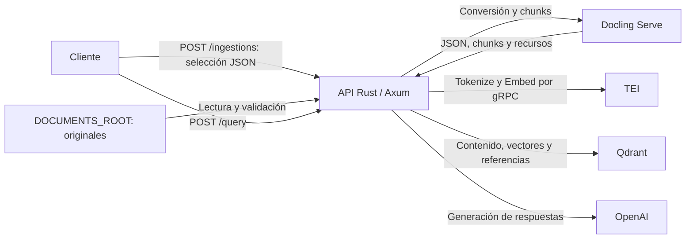

# RAG con Docling

API HTTP y biblioteca Rust para ingerir documentos desde una carpeta y responder preguntas con referencias a los archivos originales. Docling convierte y fragmenta; TEI valida tokens y genera embeddings; Qdrant almacena el índice; OpenAI genera las respuestas.

## Arquitectura



La API se ejecuta en el host. [compose.yaml](compose.yaml) define Docling Serve 1.36.0, TEI 1.9.4 y Qdrant 1.19.1. Qdrant y la caché del modelo TEI utilizan volúmenes de Podman.

## Configuración y ejecución

Requisitos: Linux, Rust/Cargo con soporte para edición 2024, `protoc` y Podman con un proveedor de Compose. El Compose incluye el dispositivo NVIDIA `nvidia.com/gpu=all`; requiere que esté disponible mediante CDI.

Crear la configuración local y ajustar sus valores:

```bash
cp .env.example .env
```

Las variables están documentadas en [.env.example](.env.example). La API carga `.env` al iniciar y respeta las variables ya definidas en el proceso. Los cambios de configuración requieren reiniciar el componente correspondiente.

| Variable | Uso |
|---|---|
| `HTTP_BIND` | Dirección de escucha de la API; predeterminado `0.0.0.0:3000`. |
| `DOCUMENTS_ROOT` | Carpeta de originales; predeterminado `manuales`. Debe existir y ser legible al iniciar. |
| `QDRANT_URL`, `QDRANT_ALIAS` | Endpoint gRPC y alias del índice. |
| `TEI_URL` | Endpoint gRPC de embeddings. |
| `EMBEDDING_MODEL`, `EMBEDDING_REVISION`, `EMBEDDING_DIMENSION` | Identidad del modelo, compatible con el servicio TEI y el índice. |
| `DOCLING_URL` | Endpoint HTTP de Docling Serve. |
| `OPENAI_MODEL`, `OPENAI_API_KEY` | Modelo y credenciales para generar respuestas. |
| `TOP_K` | Máximo de fragmentos enviados al modelo, entre `1` y `50`; predeterminado `5`. |
| `RUST_LOG` | Filtro opcional de logs; ausente o vacío usa `rag=debug` en compilaciones de desarrollo y `rag=info` en release. |

Las rutas relativas de `DOCUMENTS_ROOT` se resuelven desde el directorio de ejecución.

```bash
podman compose up -d
podman compose logs -f docling tei
```

Iniciar la API cuando los servicios estén disponibles:

```bash
curl --fail-with-body http://127.0.0.1:5001/ready
cargo run --locked
```

| Servicio | Interfaz local |
|---|---|
| API | `http://127.0.0.1:3000/health` |
| Referencia Scalar | `http://127.0.0.1:3000/docs` |
| Esquema OpenAPI | `http://127.0.0.1:3000/openapi.json` |
| Docling | `http://127.0.0.1:5001/ui` |
| Qdrant | `http://127.0.0.1:6333/dashboard` |

## Logs

La API usa `tracing` y escribe a stdout. El formato y filtro predeterminado se
seleccionan al compilar:

| Compilación | Formato | Filtro predeterminado |
|---|---|---|
| `cargo run` | Texto compacto | `rag=debug` |
| `cargo run --release` | JSON por línea | `rag=info` |

La selección usa `cfg!(debug_assertions)`: los perfiles predeterminados de Cargo
lo activan en desarrollo y lo desactivan en release. Los perfiles personalizados
que cambien `debug-assertions` también cambiarán esta selección. El formato queda
fijo en el binario.

`RUST_LOG` es opcional y modifica el detalle y los módulos registrados sin cambiar
el formato. Ausente o vacío utiliza el filtro predeterminado. Un filtro inválido
impide iniciar la API sin mostrar el valor recibido. Los errores previos a
inicializar el logger se escriben como JSON seguro a stderr. Las variables del
proceso tienen prioridad sobre dotenv.

```bash
cargo run --locked
cargo run --locked --release
RUST_LOG=rag=debug cargo run --locked --release
RUST_LOG=rag=info,rag::logging::diagnostic=debug cargo run --locked --release
```

El texto utiliza colores solo cuando stdout es una terminal. Se respeta la
preferencia estándar `NO_COLOR` si está definida y no está vacía. JSON nunca
incluye ANSI y contiene `timestamp` UTC, `level`, `target`, `fields` y el contexto
en `span` y `spans`.
Los contadores y `duration_ms` son numéricos. Los nombres en `fields.event` son
identificadores estables de eventos.

Cada solicitud recibe un UUID nuevo en `x-request-id`, aunque el cliente envíe
otro valor. El mismo identificador acompaña los eventos HTTP y sus operaciones;
`http_request_completed` también lo incluye explícitamente en `fields.request_id`.
Los spans propios conservan el contexto cuando el filtro se reduce a
`rag=warn` o `rag=error`, sin habilitar eventos más detallados. `RUST_LOG=off`
silencia los eventos. La cabecera de respuesta está documentada como UUID en
OpenAPI; `X-Request-Id` y `x-request-id` son equivalentes en HTTP.
Los spans de consulta, lote y documento añaden `query_id`, `batch_id` y
`document_id`; son identificadores aleatorios de esa ejecución, no identifican
permanentemente un archivo. Las rutas registradas son las declaradas por el
router, o `unmatched`, sin parámetros ni query string.

| Evento o detalle | Nivel |
|---|---|
| Arranque, escucha y cierre ordenado | `INFO` |
| Finalización HTTP: 2xx/3xx, 4xx, 5xx | `INFO`, `WARN`, `ERROR`, respectivamente |
| `/health` satisfactorio | `DEBUG` |
| Resumen de consulta y de lote, documento completado | `INFO` |
| Documento rechazado o completado con advertencias; corrección necesaria de citas | `WARN` |
| Documento fallido; fallo fatal del proceso | `ERROR` |
| Operación externa fallida, con servicio, operación y categoría segura | `WARN` |
| Fallo al preparar el router o abrir el puerto, con categoría y código del sistema disponibles | `WARN` |
| Etapas, recuperaciones, contadores y duración de operaciones satisfactorias | `DEBUG` |
| Sondeos repetidos de Docling mientras sigue pendiente | `TRACE` |

`http_request_completed` mide hasta que se genera la respuesta, no hasta que el
cliente termina de descargarla. Se emite una vez por respuesta. Un fallo externo
puede producir además `operation_failed` y el resumen de la consulta o documento:
representan operaciones distintas y no repiten la cadena del error. Un HTTP 200
de ingesta puede contener documentos fallidos; revisar `document_completed` y los
contadores de `ingestion_batch_completed`.

Los logs propios no incluyen nombres o rutas documentales, preguntas, respuestas,
fragmentos, embeddings, cabeceras, credenciales ni cuerpos de errores externos,
incluso en `TRACE`. Los diagnósticos utilizan códigos internos, etapas y estados
HTTP/gRPC cuando están disponibles. Esta política no modifica el contenido de
las respuestas de la API. Los filtros predeterminados solo habilitan `rag`;
habilitar dependencias con `RUST_LOG` puede incorporar datos emitidos por ellas.

La escritura utiliza `tracing-appender` en segundo plano con una cola de 8.192
líneas. Si se llena, se descartan eventos para que los productores sigan
atendiendo solicitudes. `logs_dropped` informa el total acumulado cuando aumenta,
con comprobaciones cada 30 segundos y al cerrar; también puede descartarse si la
cola sigue llena. Esta cola no es almacenamiento durable ni garantiza entrega.
Ctrl+C y SIGTERM en Unix inician el cierre ordenado y se intenta vaciar la cola
al terminar; una salida bloqueada o una terminación forzada puede perder eventos.
La recolección, retención y rotación de stdout corresponden al entorno de ejecución.

Al usar la biblioteca, el consumidor configura su subscriber. `init_logging()` es
una opción para aplicaciones con Tokio: instala el subscriber global y devuelve
un `LoggingGuard` que debe conservarse hasta después del cierre del servidor.

La implementación sigue las APIs oficiales de
[JSON en tracing-subscriber](https://docs.rs/tracing-subscriber/0.3.23/tracing_subscriber/fmt/format/struct.Json.html),
[instrumentación asíncrona](https://docs.rs/tracing/latest/tracing/trait.Instrument.html),
[Tower HTTP](https://docs.rs/tower-http/latest/tower_http/request_id/index.html) y
[escritura no bloqueante](https://docs.rs/tracing-appender/latest/tracing_appender/non_blocking/index.html).
La elección de contexto por spans y escritura en segundo plano también considera
la experiencia de [Luca Palmieri](https://lpalmieri.com/posts/2020-09-27-zero-to-production-4-are-we-observable-yet/)
y los [reportes de bloqueo de stdout de la comunidad de tracing](https://github.com/tokio-rs/tracing/issues/2653).
La selección de datos registrados sigue las recomendaciones de
[OWASP sobre logging](https://cheatsheetseries.owasp.org/cheatsheets/Logging_Cheat_Sheet.html).

## API HTTP

Las solicitudes utilizan JSON y admiten cuerpos de hasta 256 KiB. Las respuestas
incluyen `x-request-id` para localizar la solicitud en los logs, también en errores.

| Método | Ruta | Función |
|---|---|---|
| `GET` | `/health` | Devuelve `{"status":"ok"}`; comprueba que la API responde. |
| `POST` | `/ingestions` | Procesa una selección de originales y devuelve el resultado al terminar. |
| `POST` | `/query` | Responde una pregunta con fuentes del índice. |

### Documentación interactiva

`GET /docs` sirve la referencia interactiva de Scalar y `GET /openapi.json` devuelve
la especificación OpenAPI 3.1 de los tres endpoints. Ambas rutas están siempre
habilitadas. Scalar permite ejecutar solicitudes contra la API que sirve la
documentación; las ingestas ejecutadas desde la interfaz procesan los originales
igual que cualquier otra solicitud.

El esquema se genera desde los handlers y los tipos Rust con
[`utoipa`](https://docs.rs/utoipa/5.5.0/utoipa/). El HTML se genera con
`scalar_html_default` del crate oficial
[`scalar_api_reference`](https://scalar.com/products/api-references/integrations/rust),
usando la API independiente del framework sobre Axum. El navegador necesita acceso
a `https://cdn.jsdelivr.net/npm/@scalar/api-reference` para cargar JavaScript.
Scalar Agent está deshabilitado. El esquema y el HTML se construyen una vez al
crear el router; servirlos no consulta Docling, TEI, Qdrant ni OpenAI.

Para documentar un nuevo endpoint, anotar su handler con `#[utoipa::path]`,
registrarlo en `ApiDoc` dentro del módulo HTTP y derivar `utoipa::ToSchema` en sus
tipos de entrada y salida. Documentar los estados que realmente devuelve el
handler y preservar las reglas de Serde sobre campos desconocidos, omitidos y
anulables.

### Ingesta

Procesar toda la raíz, incluyendo subcarpetas:

```bash
curl --fail-with-body http://127.0.0.1:3000/ingestions \
  -H 'Content-Type: application/json' \
  -d '{}'
```

Seleccionar archivos o carpetas mediante rutas relativas:

```bash
curl --fail-with-body http://127.0.0.1:3000/ingestions \
  -H 'Content-Type: application/json' \
  -d '{"paths":["consumibles-impresoras.pdf","catalogo-software-ti.xlsx"]}'
```

`paths` omitido o vacío selecciona toda la raíz. La selección se ordena y deduplica. Se excluyen entradas ocultas de la exploración; se rechazan rutas explícitas ocultas, absolutas, con `..` o con enlaces simbólicos.

La API procesa un archivo a la vez y admite un único lote activo por proceso. Los clientes y proxies deben permitir conexiones largas. Los rechazos y fallos individuales permiten continuar con los demás archivos; las conversiones parciales con chunks válidos se indexan con advertencias.

La respuesta contiene:

- `counts`: `total`, `completed`, `completed_with_warnings`, `rejected` y `failed`. Los contadores de estado son excluyentes.
- `documents`: resultados individuales con `filename`, `source_key`, `status`, `stage`, `original_sha256`, `task_ids`, `chunks`, `warnings`, `error` y `profile`.

`error` es `null` o un objeto con `code` y `message`. Los códigos por archivo son `unsupported_extension` y `processing_failed`. Las etapas son `validation`, `snapshot`, `conversion`, `download`, `tokens`, `rechunk`, `index` y `done`. `chunks` informa los fragmentos preparados; un estado `completed` o `completed_with_warnings` confirma la indexación.

| Estado HTTP | Significado en `/ingestions` |
|---|---|
| `200` | Lote terminado; revisar los resultados individuales. Una selección vacía devuelve contadores en cero. |
| `400` | JSON o selección inválidos. |
| `409` | El esquema del índice es incompatible con la ingesta. |
| `502` | Falló la comprobación del índice en Qdrant. |
| `503` | Ya existe un lote activo. |

### Formatos admitidos

La API valida la extensión antes de crear temporales o enviar el archivo a Docling. La comparación no distingue mayúsculas. Docling valida posteriormente el contenido.

| Formato | Extensiones |
|---|---|
| PDF | `.pdf` |
| Word OOXML | `.docx`, `.dotx`, `.docm`, `.dotm` |
| PowerPoint OOXML | `.pptx`, `.potx`, `.ppsx`, `.pptm`, `.potm`, `.ppsm` |
| Excel OOXML | `.xlsx`, `.xlsm`, `.xltx`, `.xltm` |
| HTML | `.html`, `.htm`, `.xhtml` |
| Markdown y texto | `.md`, `.txt`, `.text`, `.qmd`, `.rmd` |
| CSV | `.csv` |
| AsciiDoc | `.adoc`, `.asciidoc`, `.asc` |
| Imágenes | `.jpg`, `.jpeg`, `.png`, `.tif`, `.tiff`, `.bmp`, `.webp` |
| Subtítulos | `.vtt` |

Los archivos sin extensión o fuera del catálogo reciben `status="rejected"`, `stage="validation"` y `error.code="unsupported_extension"`.

### Consultas

```bash
curl --fail-with-body http://127.0.0.1:3000/query \
  -H 'Content-Type: application/json' \
  -d '{"question":"¿Qué consumible utiliza la impresora de recepción?"}'
```

La solicitud admite únicamente `question`, que debe contener texto.

La selección utiliza exclusivamente `Config.top_k`, cargado desde `TOP_K` en el servidor: predeterminado `5`, rango `1`–`50`. La búsqueda solicita hasta `min(TOP_K × 2, 50)` candidatos y selecciona hasta `TOP_K` fragmentos mediante los filtros y el límite de contexto. Este valor no garantiza una cantidad de documentos distintos ni de citas; la respuesta puede citar menos fragmentos. La respuesta contiene `text` y `sources`:

```json
{
  "text": "Apaga la impresora antes de sustituir el cartucho. [1]",
  "sources": [
    {
      "id": "1",
      "filename": "manual-impresora.pdf",
      "source_key": "impresoras/manual-impresora.pdf",
      "location": {
        "kind": "page",
        "page_numbers": [12],
        "headings": ["Mantenimiento"]
      },
      "excerpt": "Apague la impresora antes de sustituir el cartucho."
    }
  ]
}
```

Los marcadores `[n]` vinculan afirmaciones del texto con `sources[].id`. Cada fuente representa un fragmento; un documento puede tener varias referencias. Los identificadores son cadenas numéricas locales a la respuesta. `sources` contiene únicamente fragmentos citados, sin duplicados del mismo identificador y en orden de primera aparición. Los identificadores conservan su numeración original: una respuesta que cite `[3]` y `[1]` tendrá fuentes con esos identificadores en ese orden. Los consumidores deben resolver por `id`, no por posición en el arreglo.

`filename` es el nombre visible; `source_key` identifica la ruta relativa del original. `excerpt` es el texto exacto del fragmento indexado enviado al modelo, incluido su contexto estructural; no es una cita textual seleccionada o reformulada por el modelo.

`location.kind` describe la categoría del formato: `page`, `slide`, `sheet`, `section`, `image` o `document`. No garantiza una ubicación precisa. `page_numbers` se incluye únicamente para PDF con páginas conocidas; `headings`, cuando hay encabezados. Ambos campos se omiten si están ausentes o vacíos. No se inventan números de diapositiva, nombres de hoja ni enlaces al original.

La API valida que una respuesta informativa tenga al menos una cita y que todos los marcadores correspondan a identificadores del contexto. Los corchetes se reservan para citas `[n]`, con enteros positivos sin espacios ni ceros iniciales; varias fuentes se escriben `[1][2]`. Ante una respuesta vacía, citas ausentes, marcadores inválidos o identificadores desconocidos, solicita una única corrección con la misma pregunta y contexto. Si falla nuevamente, devuelve HTTP `502` con `{"error":"No se pudo generar una respuesta con referencias válidas"}`. Los fallos del proveedor no se reintentan y devuelven el error genérico `{"error":"No se pudo generar la respuesta"}`.

La validación comprueba sintaxis y existencia de referencias; no evalúa si cada afirmación está respaldada ni detecta todas las afirmaciones sin cita. Los logs registran el motivo de validación y el resultado de la corrección sin incluir el contenido documental.

Cuando no hay fragmentos seleccionados, la API responde sin llamar al generador. Si el modelo determina que el contexto no basta, debe devolver la misma frase de insuficiencia, sin citas. En ambos casos la respuesta es `{"text":"No hay información suficiente en los documentos indexados para responder esa pregunta.","sources":[]}`.

La biblioteca expone `AnswerRequest` para la pregunta y `Answer`, `Source` y `SourceLocation` para la respuesta y sus referencias.

## Conversión y límites

Docling es el único responsable de crear los chunks. La API solicita JSON estructurado y chunks con texto contextualizado y texto original, tablas en modo `accurate` y jerarquía de encabezados PDF.

| Variable | Predeterminado | Comportamiento |
|---|---|---|
| `DOCLING_IMAGE_EXPORT_MODE` | `referenced` | `referenced`: recursos del ZIP; `embedded`: imágenes dentro del JSON; `placeholder`: estructura sin datos de imagen. |
| `DOCLING_DO_OCR` | `true` | Habilita o deshabilita OCR, independientemente del modo de imágenes. Cuando está habilitado, la conversión de archivos de imagen fuerza OCR de página completa. |
| `DOCLING_OCR_PRESET` | `auto` | Preset enviado cuando OCR está habilitado; debe estar disponible en Docling. |
| `CHUNK_TARGET_TOKENS` | `512` | Objetivo solicitado a HybridChunker. |

La conversión mantiene deshabilitadas la descripción de imágenes, clasificación visual y extracción de gráficos mediante modelos.

Para originales JPG, JPEG, PNG, TIFF, BMP y WebP, la API envía `force_ocr=true` cuando `DOCLING_DO_OCR=true`. El perfil de cada documento registra el valor efectivo. El OCR permite extraer texto de una imagen; la fotografía sin texto no se convierte en una descripción visual. Si Docling devuelve cero chunks, el documento falla antes de generar embeddings o escribir en Qdrant.

La API consulta la capacidad real de TEI y cuenta el texto final con su tokenizador, incluyendo tokens especiales. Los embeddings se generan con `truncate=false`. Si un chunk excede la capacidad, Docling vuelve a fragmentar el JSON temporal con la mitad del presupuesto: hasta tres ajustes, deteniéndose si repite el resultado incompatible. Un exceso no resuelto falla el documento.

| Variable | Predeterminado | Límite |
|---|---|---|
| `DOCLING_SERVE_MAX_FILE_SIZE` | 50 MiB | Tamaño del original. |
| `DOCLING_SERVE_MAX_NUM_PAGES` | 200 | Páginas por documento en Docling. |
| `DOCLING_SERVE_MAX_SOURCES_PER_REQUEST` | 20 | Fuentes por solicitud a Docling; la API envía un archivo por tarea. |
| `MAX_FILE_BYTES` | 10 MiB | JSONL de chunks y representación normalizada para indexación. |
| `DOCLING_MAX_DOWNLOAD_BYTES` | 32 MiB | ZIP comprimido por tarea. |
| `DOCLING_MAX_EXPANDED_BYTES` | 128 MiB | Recursos descomprimidos del ZIP. |
| `DOCLING_MAX_ARCHIVE_ENTRIES` | 200 | Entradas del ZIP. |
| `DOCLING_REQUEST_TIMEOUT_SECS` | 120 | Tiempo por solicitud HTTP a Docling. |
| `DOCLING_CONVERSION_TIMEOUT_SECS` | 1800 | Espera de finalización de cada tarea de Docling. |

## Almacenamiento e identidad

`DOCUMENTS_ROOT` conserva los originales. La API utiliza una copia temporal por documento y elimina los temporales al finalizar o ante errores controlados. Qdrant conserva contenido, embeddings, hash del original, perfil y procedencia. Los ZIP y recursos exportados se procesan en memoria dentro de los límites configurados.

`filename` es el nombre visible (`manual.pdf`); `source_key` es la ruta relativa que identifica el documento (`impresoras/manual.pdf`). Archivos con igual nombre en distintas subcarpetas tienen identidades diferentes. Una ingesta actualiza únicamente los documentos seleccionados; los documentos ausentes permanecen en el índice. Renombrar la ruta crea otra identidad.

Los resultados del lote existen durante la solicitud. Los errores de ejecución se informan sin reintentos automáticos. Un fallo de escritura en Qdrant puede dejar puntos parciales; la actualización documental no es transaccional. Un cierre abrupto puede dejar residuos temporales. El bloqueo de escritura coordina procesos del mismo host.
