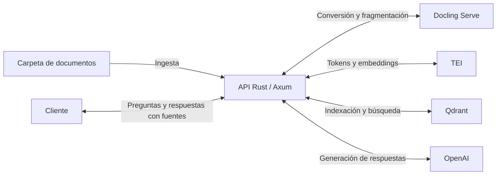

# Tisenda API

API HTTP y biblioteca Rust para consultar documentos mediante generación aumentada por recuperación (RAG). Procesa archivos de una carpeta local, crea un índice vectorial y responde preguntas con referencias a los originales.

Admite PDF, documentos de Office OOXML, HTML, Markdown, texto, CSV, AsciiDoc, imágenes y subtítulos VTT. El catálogo de extensiones está definido en [src/docling/formats.rs](src/docling/formats.rs).

## Cómo funciona

- **Docling Serve** convierte los documentos y genera fragmentos de texto, con OCR configurable.
- **Text Embeddings Inference (TEI)** valida los tokens y genera embeddings.
- **Qdrant** almacena los fragmentos, sus vectores y su procedencia.
- **OpenAI** genera respuestas a partir de los fragmentos recuperados.



La API se ejecuta en el host. [compose.yaml](compose.yaml) levanta Docling Serve, TEI y Qdrant; Qdrant y la caché del modelo TEI usan volúmenes persistentes de Podman.

## Puesta en marcha

Ejecuta los comandos desde la raíz del repositorio.

### 1. Preparar la configuración y los documentos

Si aún no tienes una configuración local, copia la plantilla:

```bash
cp .env.example .env
```

Edita `.env` para establecer `OPENAI_API_KEY` y revisar `DOCUMENTS_ROOT`. La plantilla utiliza `corpus`; crea esa carpeta y coloca allí los documentos que quieras indexar:

```bash
mkdir -p corpus
```

Si eliges otra ruta, asegúrate de que exista y sea legible. Las rutas relativas se resuelven desde el directorio de ejecución.

[.env.example](.env.example) documenta las variables de conexión, modelos, OCR y límites de procesamiento. El modelo, la revisión y la dimensión de embeddings deben ser compatibles con TEI y con el índice. La API carga `.env` al iniciar y da prioridad a las variables ya definidas en el proceso; los cambios requieren reiniciar el componente correspondiente.

### 2. Levantar los servicios

```bash
podman compose up -d
podman compose logs -f docling tei
```

Espera a que los servicios terminen de cargar sus modelos. Puedes comprobar la disponibilidad de Docling con:

```bash
curl --fail-with-body http://127.0.0.1:5001/ready
```

### 3. Iniciar la API

```bash
cargo run --locked
```

Abre [Scalar](http://127.0.0.1:3000/docs), ejecuta una ingesta de los documentos y después realiza una consulta. Es necesario indexar documentos antes de poder consultar sus contenidos.

## Documentación de la API

Scalar reúne los endpoints, los esquemas de entrada y salida, los ejemplos y los estados HTTP. Desde allí también puedes ejecutar solicitudes. La especificación OpenAPI se genera desde los handlers y tipos Rust con `utoipa`.

Estas direcciones corresponden a la configuración local de la plantilla:

| Recurso | Dirección |
|---|---|
| Referencia interactiva de la API | [Scalar](http://127.0.0.1:3000/docs) |
| Especificación para herramientas y clientes | [OpenAPI](http://127.0.0.1:3000/openapi.json) |
| Interfaz de conversión | [Docling](http://127.0.0.1:5001/ui) |
| Explorador del índice vectorial | [Qdrant](http://127.0.0.1:6333/dashboard) |

Scalar necesita acceso desde el navegador a `cdn.jsdelivr.net` para cargar su JavaScript.

## Consideraciones de operación

- **Ingesta síncrona:** se procesa un archivo a la vez y se admite un lote activo por proceso. La conexión permanece abierta hasta terminar; configura los tiempos de espera del cliente o proxy para conversiones largas. Un lote terminado puede incluir archivos rechazados o fallidos.
- **Identidad documental:** cada documento se identifica por su ruta relativa a `DOCUMENTS_ROOT`. Una ingesta actualiza los documentos seleccionados; los ausentes permanecen en el índice. Renombrar un archivo crea otra identidad.
- **Persistencia:** los originales permanecen en `DOCUMENTS_ROOT`; Qdrant conserva contenido, embeddings y procedencia. Las copias de trabajo son temporales. La actualización documental no es transaccional: un fallo de escritura puede dejar puntos parciales.
- **Conversión:** el OCR extrae texto de imágenes; no genera descripciones de fotografías. TEI valida el tamaño de los fragmentos sin truncarlos y, si es necesario, se solicita a Docling que vuelva a fragmentar. Un documento sin fragmentos utilizables no se indexa.
- **Respuestas:** las citas remiten a fragmentos recuperados. La validación comprueba el formato y la existencia de las referencias, pero no garantiza que cada afirmación esté respaldada por ellas.

## Logs

La API escribe a stdout: texto compacto con nivel `rag=debug` en desarrollo y JSON por línea con `rag=info` en release. `RUST_LOG` permite ajustar el filtro:

```bash
RUST_LOG=rag=debug cargo run --locked --release
```

Cada solicitud recibe un `x-request-id` para correlacionarla con sus logs. Los logs propios omiten contenido documental, preguntas, respuestas y credenciales. La escritura usa una cola en memoria y puede descartar eventos si se llena; la recolección, rotación y retención corresponden al entorno de ejecución.

## Desarrollo

La implementación se organiza por responsabilidad:

| Módulo | Responsabilidad |
|---|---|
| `server` | Servidor HTTP, OpenAPI y Scalar |
| `ingestions` | Selección de originales y ejecución de lotes |
| `docling` | Conversión, formatos y procedencia |
| `ingest` | Preparación de fragmentos e indexación |
| `answer` | Recuperación de contexto, generación y citas |
| `tei`, `qdrant` | Clientes de embeddings y almacenamiento vectorial |
| `config`, `logging` | Configuración y diagnóstico |
