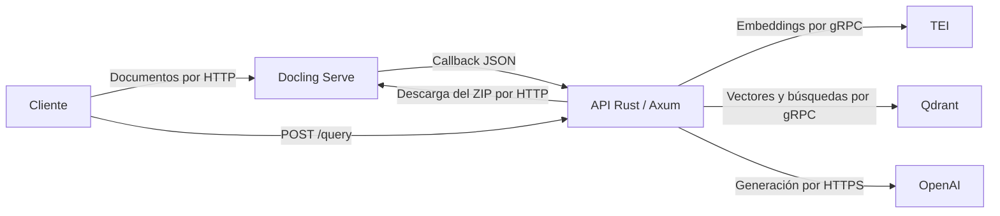

# RAG con Docling

API HTTP y biblioteca en Rust para indexar documentos y consultar su contenido mediante generación aumentada por recuperación (RAG).

## Arquitectura

Docling Serve convierte los documentos y los fragmenta mediante HybridChunker. Exporta los fragmentos contextualizados en JSONL dentro de un ZIP. La API Rust recibe el callback de conversión, descarga el resultado y valida los fragmentos. TEI genera embeddings por gRPC; Qdrant almacena los vectores y ejecuta las búsquedas por gRPC. El modelo de OpenAI genera respuestas en español con referencias a los fragmentos recuperados.



La API Rust se ejecuta en el host. Docling, TEI y Qdrant se ejecutan en contenedores definidos en [compose.yaml](compose.yaml).

Docling accede al webhook del host mediante `http://host.containers.internal:3000/webhooks/docling`.

## Configuración

Desde la raíz del proyecto, crear la configuración local a partir de la plantilla:

```bash
cp .env.example .env
```

Editar `OPENAI_API_KEY` y revisar [.env.example](.env.example), que agrupa las variables por servicio e incluye sus valores y descripciones. La API carga `.env` al iniciar; las variables ya presentes en el proceso tienen prioridad. Compose utiliza las variables del entorno y `.env` para interpolar la configuración de los contenedores.

El modelo, la revisión y la dimensión configurados deben coincidir con TEI. Los metadatos del índice vinculan el corpus con la identidad del modelo y la configuración de embeddings.

HybridChunker utiliza el tokenizador configurado en la solicitud a Docling. `chunking_options.tokenizer` debe coincidir con `EMBEDDING_MODEL`, y `chunking_options.max_tokens` con `CHUNK_MAX_TOKENS`. Rust exige un `num_tokens` positivo dentro de ese límite para cada fragmento. TEI genera los embeddings con truncamiento desactivado.

## Ejecución

Iniciar los servicios y consultar sus logs:

```bash
podman compose up -d
podman compose logs -f docling tei
```

Cuando Docling esté listo, iniciar la API Rust en otra terminal:

```bash
curl --fail-with-body http://127.0.0.1:5001/ready
cargo run --locked -- serve
```

Comprobar la respuesta HTTP de la API:

```bash
curl --fail-with-body http://127.0.0.1:3000/health
```

El comando `cargo run --locked -- --no-env-file serve` utiliza exclusivamente las variables del proceso. `RUST_LOG` controla el filtro de logs; el filtro predeterminado es `rag=info`.

Los volúmenes `qdrant-data` y `tei-bge-m3-cache` conservan, respectivamente, los datos de Qdrant y la caché del modelo de TEI.

### Interfaces web

Con los servicios en ejecución, abrir estas rutas en el navegador del host:

| Servicio | Interfaz | URL |
|---|---|---|
| [Qdrant](https://qdrant.tech/documentation/web-ui/) | Dashboard de colecciones y puntos | [http://127.0.0.1:6333/dashboard](http://127.0.0.1:6333/dashboard) |
| [Docling Serve](https://github.com/docling-project/docling-serve#demonstration-ui) | Playground de conversión de documentos | [http://127.0.0.1:5001/ui](http://127.0.0.1:5001/ui) |

## Ingesta de documentos

### Enviar un lote desde la terminal

El endpoint de Docling `POST /v1/convert/file/async` recibe una solicitud `multipart/form-data`. Cada campo `files` adjunta un documento al mismo lote. Este ejemplo utiliza los archivos incluidos en [manuales/](manuales/):

```bash
curl --fail-with-body \
  http://127.0.0.1:5001/v1/convert/file/async \
  -F 'files=@manuales/acceso.md' \
  -F 'files=@manuales/solicitud-compras.md' \
  -F 'files=@manuales/gestion-documentos.md' \
  -F 'to_formats=chunks' \
  -F 'chunking_options={"chunker":"hybrid","tokenizer":"BAAI/bge-m3","max_tokens":512,"merge_peers":true,"include_raw_text":false,"use_markdown_tables":false,"use_markdown_images":false}' \
  -F 'target_type=zip' \
  -F 'image_export_mode=placeholder' \
  -F 'abort_on_error=false' \
  -F 'callbacks=http://host.containers.internal:3000/webhooks/docling'
```

Docling devuelve un `task_id` para el lote. Para enviar otros documentos, sustituir las rutas y añadir campos `files` hasta el límite de `DOCLING_SERVE_MAX_SOURCES_PER_REQUEST`. El ejemplo utiliza el modelo y el límite de tokens de `.env.example`; ajustar ambos valores de `chunking_options` al cambiar esa configuración.

| Campo | Valor utilizado | Propósito |
|---|---|---|
| `files` | Un campo por documento | Adjuntar los originales |
| `to_formats` | `chunks` | Exportar fragmentos nativos en JSONL |
| `chunking_options` | Objeto JSON con `chunker=hybrid` | Configurar tokenizador, límite y contextualización |
| `target_type` | `zip` | Agrupar los resultados en un archivo descargable |
| `image_export_mode` | `placeholder` | Representar las imágenes con marcadores |
| `abort_on_error` | `false` | Permitir resultados individuales dentro del lote |
| `callbacks` | URL del webhook Rust | Notificar el progreso y el resultado de la conversión |

### Procesamiento del resultado

1. Docling envía un callback JSON a `POST /webhooks/docling`.
2. El evento `update_processed` inicia el procesamiento del lote en segundo plano.
3. Si hay conversiones con estado `success`, Rust realiza una descarga de `GET /v1/result/{task_id}`.
4. Rust abre el ZIP en memoria y lee `<nombre>.chunks.jsonl`, con un objeto JSON por línea.
5. Valida todo el documento: nombre original, índices consecutivos desde cero, texto y tokens. Si existe `metadata.origin`, su `filename` debe coincidir con el original.
6. Rust envía el campo `text` de cada fragmento a TEI y escribe el vector y los metadatos nativos en Qdrant.
7. El resultado de cada documento se registra en los logs.

Los nombres originales identifican los documentos. Cada lote debe utilizar nombres base distintos: `acceso.pdf` y `compras.docx` generan `acceso.chunks.jsonl` y `compras.chunks.jsonl`. Un lote que contenga `manual.pdf` y `manual.docx` produce una correspondencia ambigua; ambos documentos se registran como fallidos.

Se indexan documentos con conversión `success` y fragmentos válidos. Las conversiones parciales, los documentos vacíos y los resultados inválidos se registran como fallidos. Los documentos válidos del lote se procesan de forma independiente. Los archivos del ZIP se leen en memoria.

### Contrato de los fragmentos JSONL

Cada línea sigue el esquema nativo `ChunkedDocumentResultItem` de Docling:

| Campo | Tipo | Uso |
|---|---|---|
| `filename` | `string` | Nombre original del documento |
| `chunk_index` | `integer` | Posición consecutiva desde cero |
| `text` | `string` | Texto contextualizado que se envía a TEI |
| `raw_text` | `string` o `null` | Texto sin contexto; el ejemplo lo omite mediante `include_raw_text=false` |
| `num_tokens` | `integer` | Tokens del texto contextualizado contados por HybridChunker |
| `headings` | Lista de strings o `null` | Encabezados del fragmento |
| `captions` | Lista de strings o `null` | Leyendas del fragmento |
| `doc_items` | Lista de strings | Referencias a elementos del documento, como `#/texts/0` |
| `page_numbers` | Lista de enteros o `null` | Páginas de origen, comenzando en uno |
| `metadata` | Objeto o `null` | Metadatos adicionales, incluidos origen e indicadores de imágenes |

El payload de Qdrant conserva estos campos junto con la identidad y los hashes del índice. `text` ya contiene el contexto estructural generado por Docling; se utiliza directamente para embeddings.

Los enteros de `metadata` que superan el rango de 64 bits con signo se almacenan como cadenas decimales para conservar su precisión, por ejemplo ciertos valores de `origin.binary_hash`. El hash del documento se calcula sobre los valores nativos antes de esa adaptación.

## API HTTP

La API acepta cuerpos JSON de hasta 256 KiB.

| Método | Ruta | Función |
|---|---|---|
| `GET` | `/health` | Comprobar que la API responde |
| `POST` | `/query` | Consultar el corpus |
| `POST` | `/webhooks/docling` | Recibir los callbacks de Docling |

### Consultar documentos

Con la API en ejecución y los documentos indexados, enviar una pregunta a `POST /query`. Este ejemplo consulta el contenido de [manuales/acceso.md](manuales/acceso.md):

```bash
curl --fail-with-body \
  http://127.0.0.1:3000/query \
  -H 'Content-Type: application/json' \
  -d '{
    "question": "¿Qué datos necesito para solicitar una cuenta?",
    "top_k": 5
  }'
```

La respuesta JSON contiene `text` con la respuesta y `sources` con las referencias a los fragmentos recuperados. `top_k` es opcional, admite valores de 1 a 50 y utiliza `TOP_K` al omitirse.
